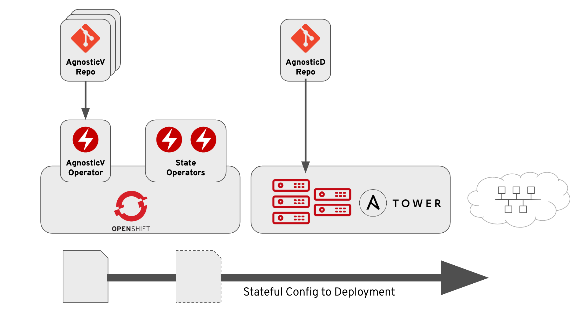

== Project Babylon

Home to the documentation and shared resources for The Babylon Project

=== Main Components

* link:https://github.com/redhat-cop/agnosticd[AgnosticD - An Ansible based Cloud Agnostic Deployment Framework]
* link:https://github.com/redhat-cop/agnosticv[AgnosticV - Catalog management, Configuration and vars for AgnosticD]
* link:./agnosticv-operator[AgnosticV Operator]
* link:https://github.com/redhat-cop/anarchy.git[Anarchy - OpenShift Operator for Stateless API operations]
* link:https://github.com/redhat-cop/poolboy.git[Poolboy - OpenShift Operator to manage OpenShift resources]
* link:https://github.com/rhpds/babylon_anarchy_governor[Anarchy Governor]
* link:https://github.com/rhpds/sandbox[Sandbox] - Ephemeral accounts

=== Getting Started

* Start with link:docs/Deploying_Babylon.adoc[Deploying Babylon Suite of Components]
