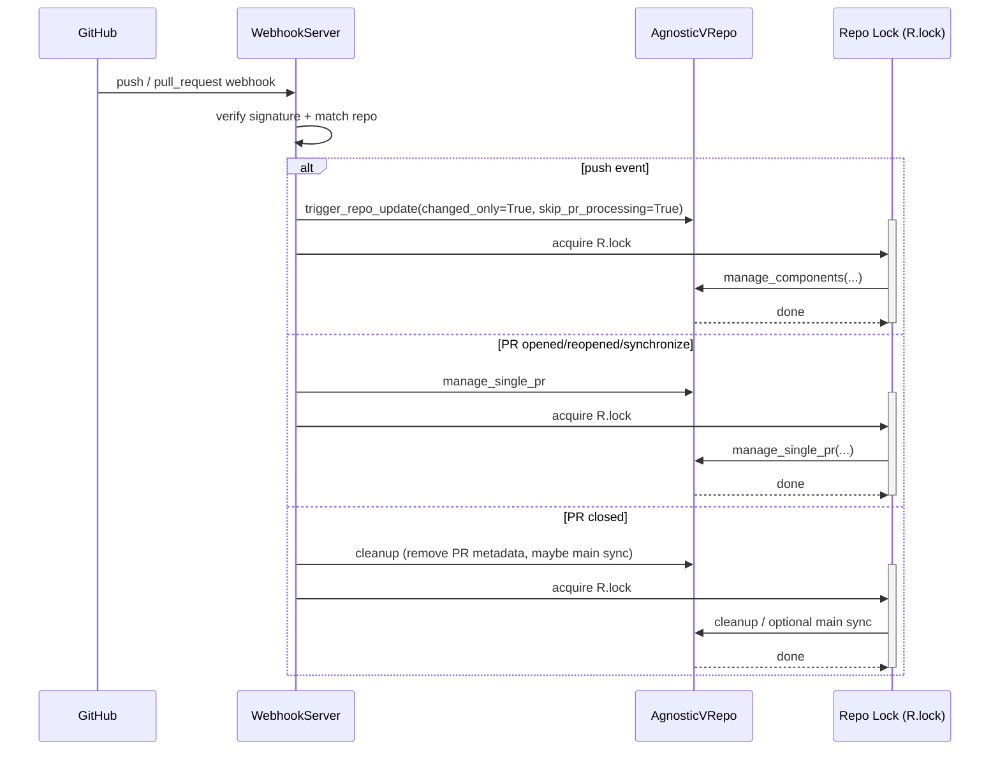
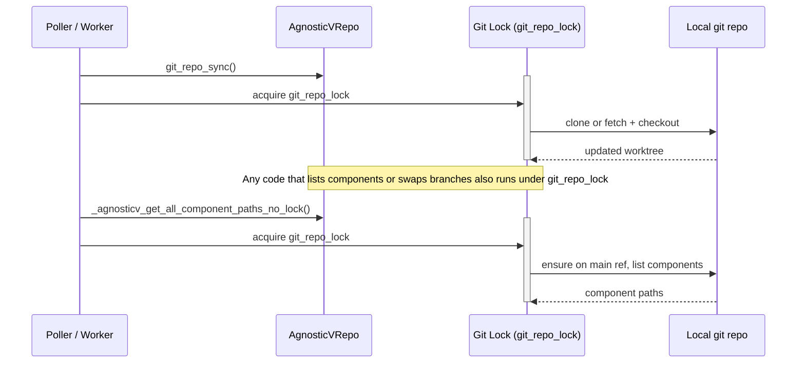
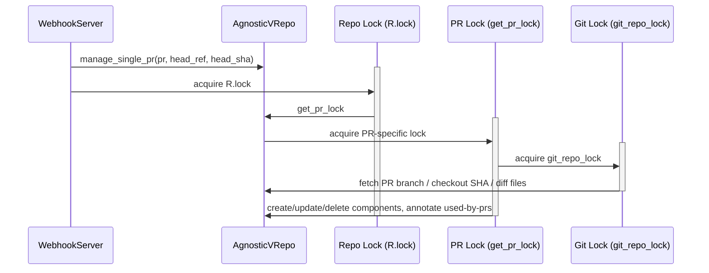
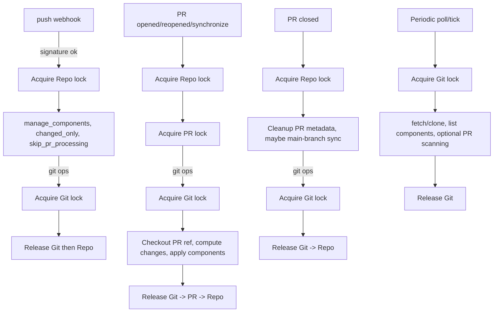
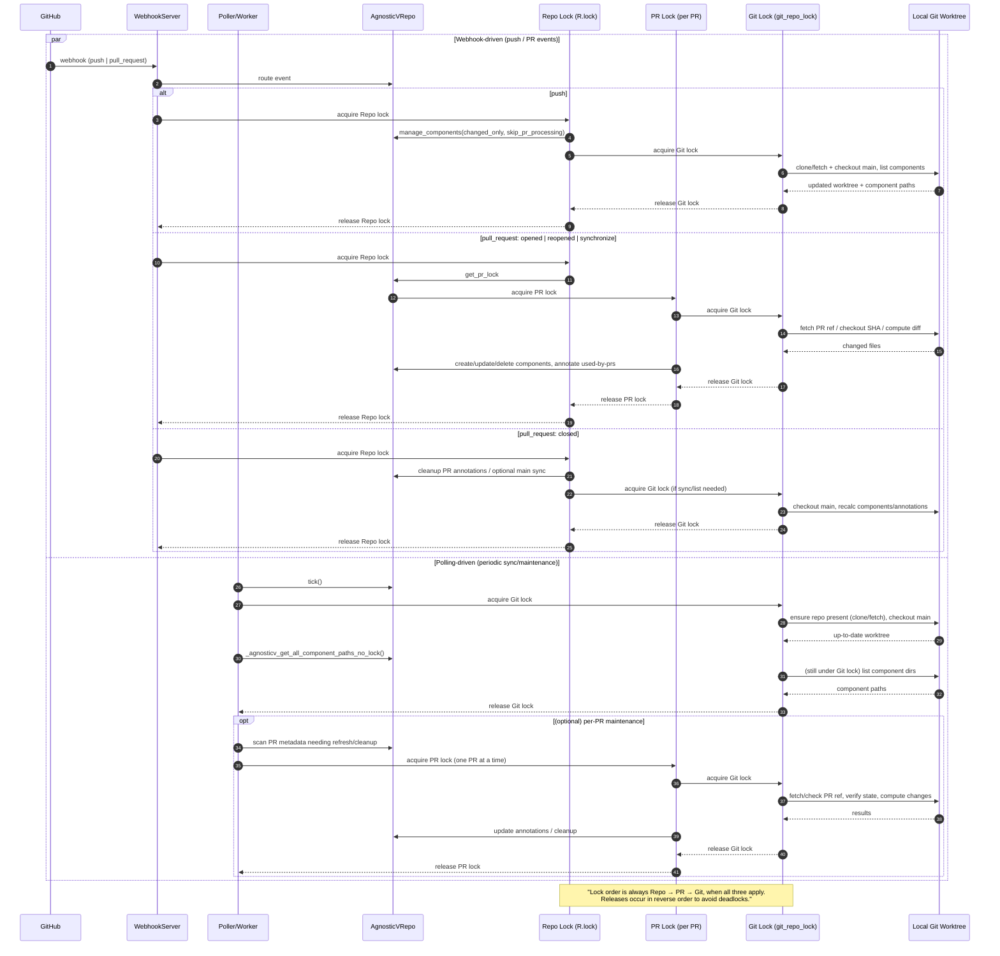

# agnosticv-operator

## Locks

Quick gist (grounded in code):

* **Repo lock** = object-level lock on an `AgnosticVRepo` instance; used by the webhook handlers to serialize high-level repo work like `manage_components(...)` and single-PR processing. 
* **Git lock** = `git_repo_lock`; guards *all* clone/fetch/checkout and component listing to avoid concurrent git operations.
* **PR lock** = per-PR lock from `get_pr_lock(pr_number)`; prevents races between webhook PR processing and polling/cleanup touching the same PR.

### 1) Repo lock (high-level orchestration on webhooks)

*(Repo lock via `async with agnosticv_repo.lock:` in webhook paths; push uses `manage_components(..., skip_pr_processing=True)`, PR events call single-PR/cleanup paths.)*   

### 2) Git lock (protect all git operations)

*(Locking in `git_repo_sync(...)` and component listing/checkout paths; “no_lock” internals are only called while holding `git_repo_lock`.)*  

### 3) PR lock (per-PR race-free processing)

*(`manage_single_pr` wraps work in `get_pr_lock(pr_number)`; inside that, git work is still protected by `git_repo_lock`. Cleanup paths also use PR locks before mutating annotations/deletions for a given PR.)*   

### 4) Which locks fire for which actions (order of acquisition)

side-by-side view that shows **webhook** vs **polling** paths and how they contend for the three locks.

