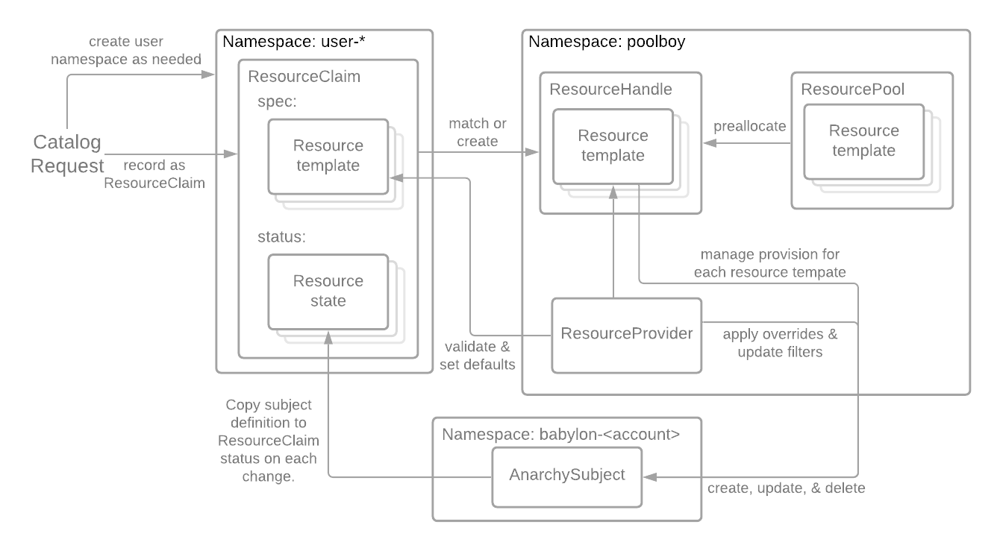

== Poolboy

Poolboy manages requests for infrastructure provisioning and pools of preallocated environments.

Catalog requests are recorded as ResourceClaims in user namespaces.

Each ResourceClaim includes one or more resource templates in its `spec` section.

Each resource template in the ResourceClaim is matched to a ResourceProvider which sets defaults and validates values used in the template.

The ResourceClaim is matched to an existing ResourceHandle or a new one is dynamically created based on the resource templates within the ResourceClaim.

ResourceHandles may be preallocated from ResourcePools to allow for environments to be fully provisioned in advance of user requests.

The ResourceProvider and resource templates in the ResourceHandle are combined to manage an AnarchySubject for each template. As the AnarchySubject changes its state is replicated into the status of the ResourceClaim to allow controlled access to the AnarchySubject data for the user.
